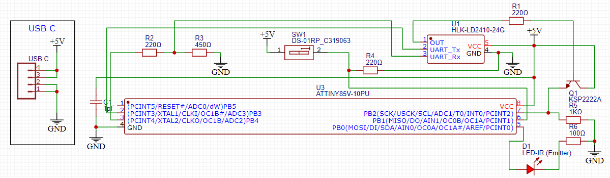
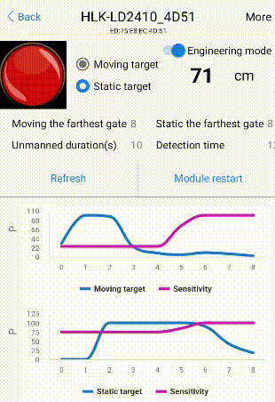
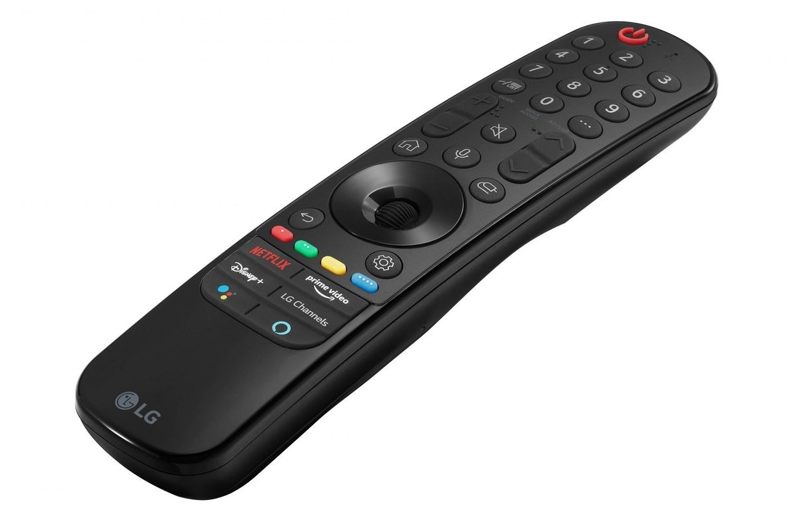

# LG OLED Screensaver
Using an OLED TV as a PC monitor comes with multiple functional drawbacks compared to traditional dedicated monitors. Despite today having native support for VRR, high refresh rates, and in some cases 8K resolution via the HDMI 2.1 protocol, the panel itself has a small risk of burn-in on any bright static content over time.

The main focus of this approach is to disable the panel without turning the entire TV off when not in use, regardless of the input selected or the content being displayed. This allows for a quick "power-on" when enabled again and does not lose sound niether involves with other CEC devices connected to it.

Since this approach is PC-less it means can be used with diffrent purposes other than PC monitor, eg: as a auto power-off when the TV is being used by kids and the room is left empty with live TV playing (where the native screensaver is not available). The main idea of the board is to replicate the IR codes of a generic TV controller where the microcontroller code can be modified for a difrent purpose. Complex behivour might need to root the TV itself.

## Requirements
The main sensor used for presence detection is mm-wave radar, which is capable of detecting immobile living beings by the movement of the ribcage while breathing making it the perfect replacement for traditional PIR approach. The full hardware materials are as follows:

- LD2410 mm-wave radar
- ATtiny85
- USB-C cable connector (PD trigger used [here](https://www.aliexpress.com/item/1005003510992977.html?spm=a2g0o.order_list.order_list_main.103.495f194du0KuyL "Type-C PD Decoy"))
- NPN transistor
- IR LED emitter
- Ceramic capacitor
- Dip switch
- Multiple resistors

> The bluetooth variant of the radar ([LD2410B](https://www.aliexpress.com/item/1005005278795918.html?spm=a2g0o.order_list.order_list_main.56.495f194du0KuyL "BLE Radar Sensor")) is recomended for future calibration once installed. Otherwise, a PC serial communication is required.

On the TV side, is completly optional to root the TV to archieve advance commands such as opening apps, TV setup, etc. In order to toggle the energy saver `SCREEN_OFF` state in one button press the [LG Input Hook](https://repo.webosbrew.org/apps/org.webosbrew.inputhook) app is required to be installed with root access. More details about rooting can be found [here](https://github.com/RootMyTV/RootMyTV.github.io "Easy method").

## Wiring
It is recommended that the USB power input comes from a TV port, carrying out the entire process automatically. The schematic includes a DIP switch to toggle the bluetooth of the radar after manual calibration is complete. The gerber file is included to directly print the PCB and the housing is completely optional.



## Calibration
The sensor can detect living beings at a distance of up to 5 meters and must be set to a lower sensitivity in order not to misinterpret other objects in case of outdoor installation. In this case, **lower sensitivity means higher probability**.

By default, bluetooth is enabled and can be calibrated on the fly with the [HLKRadarTool](https://play.google.com/store/apps/details?id=com.hlk.hlkradartool "Android app but also available for iOS") app: the two main graphs are based on probability (`Y axis`) with measured distance (`X axis`). To disable the sensor it is only necessary to set the sensitivity to 100% (instead of 0%) at a specific distance.

Once a living being comes within range of the radar it will show up first on the motion graph, once it stops moving these measurements should transition to the static graph, while the first graph should go near 0% and only reversed once the subject moves again.

<p align="center">
    
</p>

Greater detail must be taken when calibrating the static graph, since it is a precision sensor the minimum probability will vary depending on the individual's breathing pattern, that is, if for some reason the individual holds breathing for a couple of seconds the probability of the graph will drop drastically along with it. To compensate for this, the sensor delay can be adjusted as the `Unmanned duration(s)` parameter.

> Please consider that the sensor can go through light materials such as blinds, glass or thin walls when calibrating the maximum distance.

## Setup
The code is configured to be used with an LG C1 TV, therefore the times for the root scripts to take effect are estimated. Other basic rootless deployments do not require the mentioned delays:

```C++
delay(18700);                       //Wait for the WebOS system to start (about 20" seconds)
```

When rooting, only one control button needs to be sacrificed to function as a trigger to toggle the display. In the included code the energy saving button is selected as it is no longer part of the magic remote included, therefor cannot be triggered by accident under normal circunstances. Other buttons can be used instead if necessary (also stored in the main code).

<p align="center">
    
</p>

Once the TV gets the desired button code within the app, the option to assign it to a code execution is available. The command required to turn off the display is as follows:

```cli
luna-send -n 1 'luna://com.webos.service.tvpower/power/turnOffScreen' '{}'
```

Any other button press should return the display state back to normal.

## FAQ & Troubleshooting
Any suggestion or correction is welcome.

###### Would I need to root my TV?
If your goal is to achieve an action that can be done with the default controller but automatically, then no modifications to the TV are required as root. Root is only used as a means to map existing control buttons to complex actions like: TV settings, opening apps, etc.

###### Can I use it on any other non-LG TV?
It is possible to use another brand of TV but the actions may be limited and the included IR codes will not be compatible. If you want to try it, you'll need to check the [IR library](https://github.com/Arduino-IRremote/Arduino-IRremote "Arduino library documentation") documentation.

###### Why is the radar still on when the TV is off?
The USB port on the TV that is used is always on by default. You'll need to dig into the settings to disable the power when it's off.

###### Can't compile the code for an ATtiny due of memory concerns?
Multiple memory optimizations can be applied to leave enough dynamic memory (SRAM) for local variables. Some approaches are: storing some global variables in flash memory instead of SRAM using the PROGMEM keyword, disabling serial communication when not in use, or even going with a microcontroller with more memory (like the ATtiny84 or other arduino boards).

###### The radar doesn't acknowledge the setup mode, what is wrong?
From power on, the radar module needs about 1 second to start receiving serial commands.
